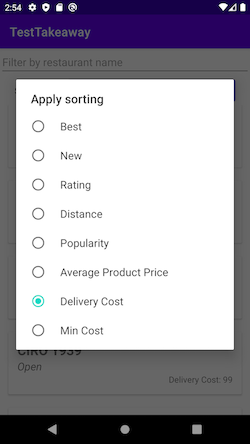

# Takeaway Android Assignment

## Preview

## Tech Stack
- **Hilt**: For big projects I prefer Dagger2, because it is a powerfull and flexable tool that works in compile time. But on this simple project I've chosen Hilt because it is like superstructure on Dagger2, and also allows to write less boilerplate code.
- **Coroutines**: I used this for asynchronous tasks, because this tool allows to write easy to understand and consistent code, also coroutines work on "light-weight" threads that can give impact on performance;
- **AdapterDelegates**: This lib also helps to work easily with list items by simple creating and being friendly for reusing, also reduce boilerplate code;
- **Kaspresso**: Based on espresso/kakao, this framework helps with working with UI tests easily (finding views, perform some actions, checks);
- **ViewBinding**: tool which helps to work with Views easily;

## Architecture
According to Clean Architecture I've separated logic on Presentation / Business / Data layers.  
Separation of logic on several layers gives us an opportunity for reusing some parts of application, change implementation, and make test covering easily.

### Data Layer
Is contained in `:data` module, contains Repository as entrance point, and DataSource that parses example json.  
We can easily override the DataSource for internet connection if we need this.

### Presentation Layer
Based on MVVM pattern, with separated logic for handling with state of screen, and logic for sorting items.

I choose MVVM pattern because it is more flexible for reusing ViewModels with another screens,   
we do not have strong relationship between View and Presentation (for example),   
and with combination with AndroidX ViewModel it helps us to easily handle the recreation of the screen.

I separated logic in Presentation layer into several classes according to Single Responsibility Principle of SOLID, that also makes test covering easier.